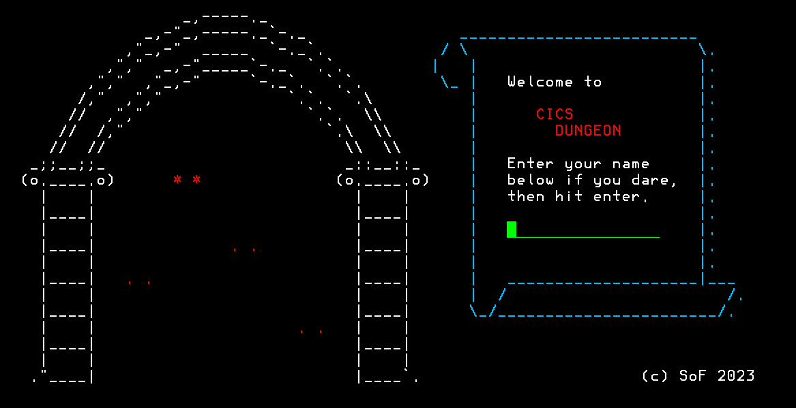
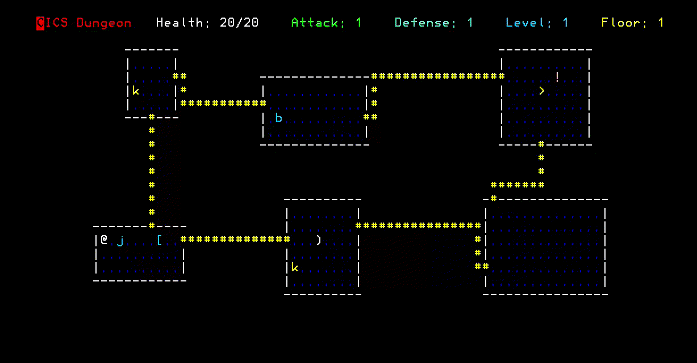

# Welcome to the CICS DUNGEON

You stand before a dark and ominous dungeon. You know that great
danger lurks within, but you are also drawn by the promise of
tapes and glory.

You take a deep breath and step inside. The door slams shut behind
you, leaving you in darkness. You can hear the sound of giant spiders
scuttling in the shadows.

You draw your sword and make your way forward. You don't know what
lies ahead, but you're determined to find out.

## How to play

After instalation you can run the game by using either command at the
TSO READY prompt:

- `DUNGEON`
- `KICKS PCT(2$) PPT(2$)`

The point of the game is to get to the lowest dungeon level and defeat the
boss that waits there for you. To navigate around you can use the **F1** 
through **F4** keys for movement:

  - **F1** Left 
  - **F2** Down 
  - **F3** Up 
  - **F4** Right 

Clearing a floor levels up your character. There are weapons `)`,
armor `[` and potions `!` to collect. There are also enemies sowatchout!

### Exiting the game

To exit the game you can press ***F3*** on the title screen to exit, 
this will take you to a blank screen. 

To exit the dungeon press ***F9*** then ***F5*** on the gameover screen. This will
also take you to a blank screen. 

Once at the blank screen type `KSSF` to exit KICKS. 

## Instalation

The file ***DUNGEON.jcl*** contains the entire game. If you're running the 
MVS/CE KICKS docker container you can installit by running: `cat DUNGEON.jcl|ncat localhost 3505` where `localhost` is the hostname of you system running KICKS. You can find a copy of the KICKS docker container
here: [KICKS](https://hub.docker.com/r/mainframed767/kicks). If you're already running docker you can run the script `docker_run.sh` to deploy a KICKS container. 

If you're running any other builds (TK4-, TK5, etc) you need to change the code page in the file `conf/tk5.cnf` and add the following after DIAG8CMD `CODEPAGE  819/1047 # Uses the 1047 ASCII/EBCDIC codepage`. Then to compile you must run the script `release.sh` passing it the following arguments:

**YOU MUST PASS ALL 6 ARGUMENT**

- Arg 1: KICKS HLQ. i.e. If your KICKS datasets are `HERC01.KICKSSYS.V1R5M0.GCCCOPY` then arg 1 would be `HERC01`
- Arg 2: the dataset that contains `PDSLOAD`, if this program is found in `SYS2.LINKLIB` then arg 2 would be `SYS2.LINKLIB`
- Arg 3: The HLQ for GCCMVS. If GCC is stored in `GCC.V85.*` pass this argument `GCC.V85`
- Arg 4: The HLQ for PDPCLIB. If the PDP C Library is stored in `PDPCLIB.V85.*` then you would pass the argument `PDPCLIB.V85`
- Arg 5: the username used to submit the job, likely `HERC01`
- Arg 6: the password for that user, likely `CUL8TR`

With all that our final release command would be `./release HERC01 SYS2.LINKLIB GCC PDPCLIB HERC01 CUL8TR ` which will generate the JCL to install the game. 

